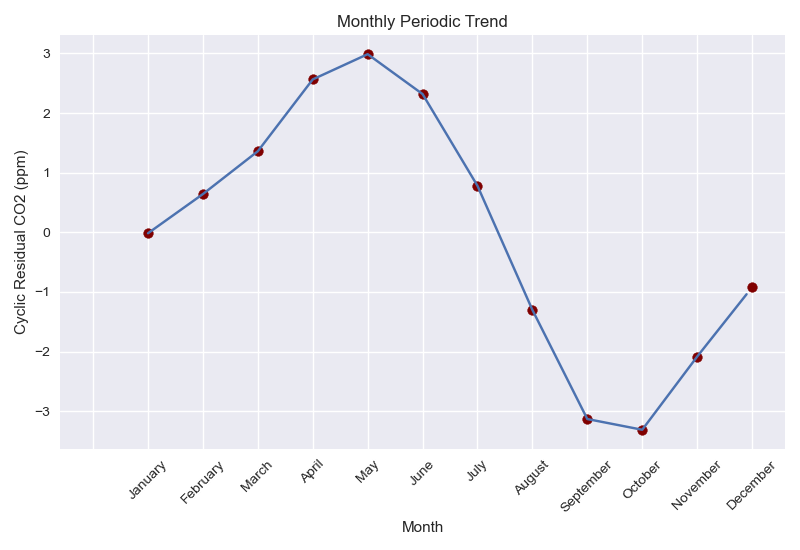
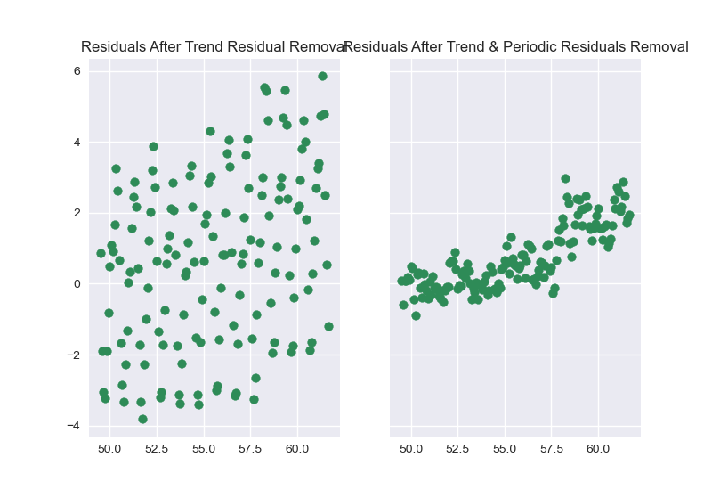

# Atmospheric CO2 Concentration
### A Time-Series Exploration

The New York Times noted that in May 2021, the amount of carbon dioxide in Earth's atmosphere hit the highest levels in human history, despite a temporary dip in CO2 emissions caused by COVID-19 shutdowns ([source](https://www.nytimes.com/2021/06/07/climate/climate-change-emissions.html?referringSource=articleShare)). In fact, the dip in emissions was too small to impact atmospheric CO2 concentration at all, according to the data recorded by the [NOAA](https://www.noaa.gov/) Observatory, which has been measuring Earth's atmospheric CO2 concentration atop Mauna Loa in Hawaii since 1958.

This scenario is a particularly good demonstration of how time-series regression can be used to model historic data and extrapolate to the future. This prediction serves as a decent (but maybe conservative) baseline for a "do-nothing" option for reducing CO2 emissions. Of course, if humanity gets its act together, the projection will change.

#### CO2_model.py - Finding the right model

#####  Step 1 - The Basics
Load and clean the data with Pandas, of course.
* Load it with Pandas and convert to dataframe, which will make it easier to work with
* Grab data of interest and drop the rest
* Establish a reference date (March 1958, first measurement)

Create utility functions
* split_data():  - We will train the model on the "train" set and evaluate its performance on the "test" set
* calc_error(): - Resid, RMSE, MAPE
  * We will calculate the residuals - the sum of the difference between the model predicted value and ground truth.
  * We will use root mean square error (RMSE) to evaluate the quality of regressions, and we will also calculate mean absolute percentage error (MAPE). These will typically be calculated on the "test" data to evaluate the model performance. Both algorithms are available through SKLearn.
* Interpolate1d_function - simple interpolation

#### Step 2 - The Regression
The implementation is simple with SKLearn - let's plot the linear, quadratic, and cubic regressions with their respective RMSEs.


It's clear that the lowest test error is with quadratic regression, but we are not capturing the cyclic nature of the data. We could also plot the residuals and observe that there is a trend, which indicates that the series is not yet stationary.

#### Step 3 - Cyclic Regression

There's obviously a cyclic nature to CO2 concentration. This can be explained by seasonal changes that impact vegetation, soil moisture, and ocean temperature.

The periodic residual is the monthly mean of the residuals from the quadratic regression. These are plotted below.



#### Step 4 - The Final Model

The final model incorporates the coefficients and y-intercept from the quadratic regression with the cyclic regression in the formula

```python
co2_df["predicted_y"] = co2_df["Date Index"] * first_order + \
                           co2_df["Date Index"] ** 2 * second_order + \
                           intercept_quadratic + \
                           co2_df["Periodic Residual"]
```


Visualizing the residuals from before and after the cyclic trend were removed is another way of showing how removing the periodic residual helps the regressions



The upward trend in the residual indicates that we are underpredicting CO2 closer to present-day. We can keep this in mind when extrapolating beyond present-day; this analysis definitely does __not__ represent the worst-case. In fact, we might actually get better predictions by performing the regression on _less_ data


#### CO2_Prediction.py - Extrapolation

#### Step 1 - Load data & Create Train/Test split

Training data is all seen data, and our test set is from 2019 to 2050

#### Step 2 - Quadratic Regression

Find coefficients and y-intercept

#### Step 3 - Calculate Quadratic Residuals

Find the residuals with the calc_error function.

We need to explicitly return the residuals in order to calculate the periodic residuals instead of just letting the quadratic regression call the error function

#### Step 4 - Calculate Periodic Residuals

Calculate the periodic residuals in the same way as before

#### Step 5 - Create Test Data

We want to create a separate dataframe for all unseen data, which has info in the Date Index, Month, Year, and Periodic Residual columns. CO2 is np.NAN, as there is obviously no ground truth.

#### Step 6 - Merge

Merge CO2 and CO2 test dataframes.

#### Step 7 - Final Model

Calculate the predicted atmospheric CO2 concentration based on the regression and residuals from all known data from 1958 to 2019.

#### Step 8 - Plot Data


As you can see, we are well on our way to 500 ppm atmospheric CO2 concentration.
